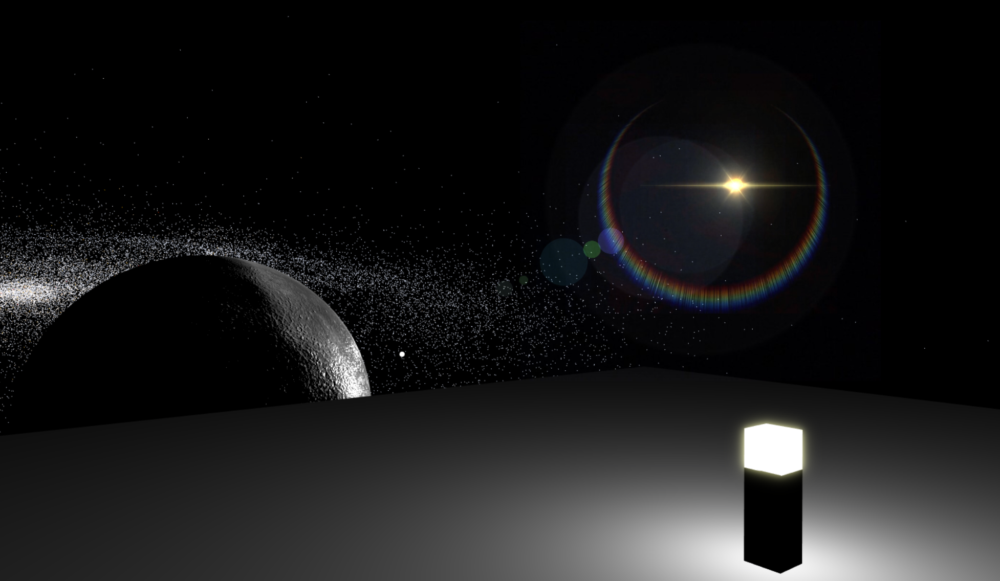
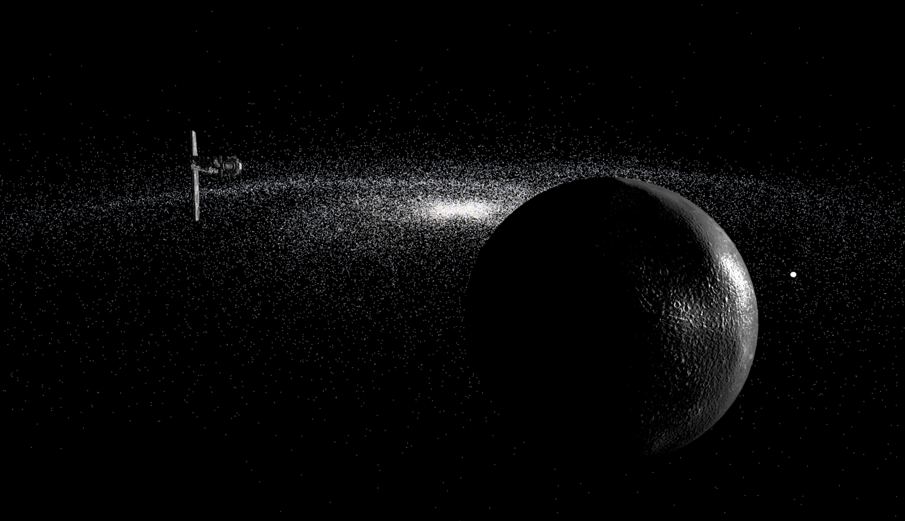

# 3D Space Deck (Web Experience)

Recently I've noticed that 3D related graphics (games, virtual sims, etc.) were less prevalent on the web than their desktop counterparts. The few that do, existed in the form of short demos and mini games. I was intrigued and began the ambitious journey of exploring the capabilities of 3D graphics on the web. This project is the culmination and application of that journey.

The environment is set in outer space, with some moving visuals and interactive elements, and the freedom to move and look around. I decided to use [BabylonJS](https://www.babylonjs.com/), a 3D JavaScript engine that comes with good documentation and framework tools. I've also sourced some high quality assets from [Sketchfab](https://sketchfab.com/).


 

### Technologies and Tools Used
* BabylonJS
* NodeJS
* HTML, CSS, JavaScript
* Blender for editing/preparing the 3D models

### Instructions

#### Navigation
Move: `w a s d`  
Toggle between first person and orbit view: `c` 

#### Interactions
Toggle night lamp on/off: `e`  
Select the spaceship or the planet while in orbit mode to switch between orbit objects

### Setup
To run this project, install it locally using npm:  
```
yarn install && yarn start
```

### Requirements
* A fast GPU for running WebGL
* Patience while the textures and assets load, which might take a few minutes
